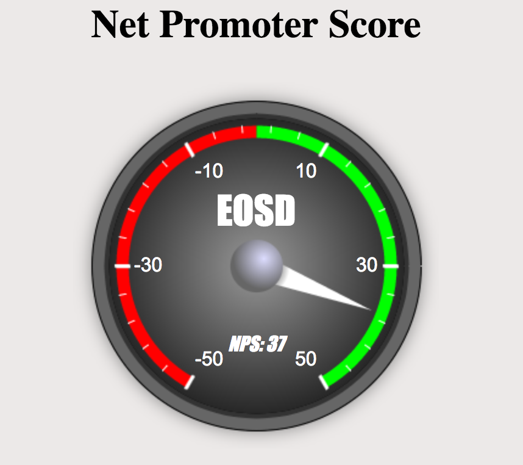

Net Promoter Score
====================================

### Italy EOSD NPS tool
This application is intended to support the NPS metric process. It has been developed in Bluemix,
using the Node-Red starter boilerplate.  

### How does this work?
When you open the webpage, you are requested to evaluate EOSD department services with a scale
from 0 to 10. The defaulted webpage address name is set within Node-Red node (here it is called `root`/setscore) 

When you press the submit button, score is then registered, as a record, in Cloudant DB.

The second webpage, here called `root`/scoreNPSdata, provides you with the overall NPS score for EOSD department.

### Customising Node-RED
This repository is here to be cloned, modified and re-used to allow anyone create
their own Node-RED based application that can be quickly deployed to Bluemix.

The Node-Red flows are stored in the `defaults` directory in the file called `flow.json`.
When the application is first started, this flow is copied to the attached Cloudant
instance. Otherwise, you could copy the entire flow and paste it into Node-Red, using the import capability.

The image content is stored under the `public/images` directory.

If you do clone this repository, make sure you update this `README.md` file to point
the `Deploy to Bluemix` button at your repository.

Marco D.
